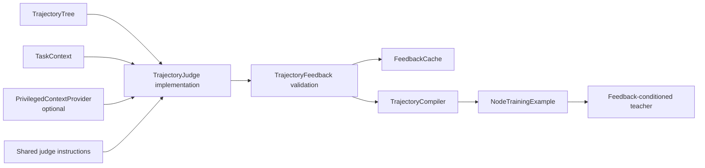
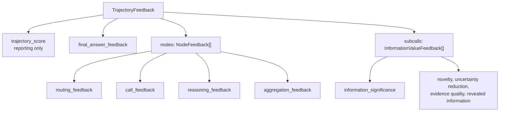

# Judge package

The `rlm_train.judge` package defines how a completed recursive trajectory is evaluated.
It is provider-independent: the package contains the task context, structured output
schema, shared instructions, a bounded-retry judge runner, and persistent cache. A small
client protocol is the only provider-specific boundary.

Its central responsibility is to produce feedback that is addressable to specific tree
nodes and decisions rather than one undifferentiated trajectory critique.

## Where it fits



A judge client may use a hosted model, local inference, or a deterministic rubric. As
long as it implements `StructuredJudgeClient.complete()`, the structured runner handles
schema validation, node-reference validation, bounded retry, and content-addressed
caching consistently.

## Feedback organization



`NodeFeedback` is keyed by `node_id`. `InformationValueFeedback` is keyed by both the
parent node that asked the question and the child node that returned the result.

`InformationValueFeedback.to_teacher_view(mode)` deterministically projects the rich
private assessment into exactly one immutable run-selected view. `scalar` exposes only
bounded scores and flags; `diagnostic` adds one edge-local defect description; `factual`
adds concrete revealed information as an intentionally rich control. The restricted
models do not even define factual/reference fields, so rationale, final correctness,
reference answers, sibling feedback, and outcome contribution cannot cross accidentally.

## Subcall information value

Subcalls and generated questions are assessed by the significance of the information
they reveal relative to what was available before the call. They are **not** assessed by:

- whether the parent used the information;
- whether the information contributed to the final answer;
- whether the final answer was correct.

This distinction allows a call to receive positive feedback when it reveals important
evidence inside an ultimately incorrect trajectory. It also allows a redundant call to
receive a penalty even if the final answer happens to be correct.

The signed `information_significance` value is constrained to `[-1, 1]`. It is currently
a placeholder signal: its eventual calibration and weight in a training objective remain
separate decisions. The supporting fields make that future calibration auditable:

- `novelty`: was the information already available to the parent?
- `uncertainty_reduction`: did the result resolve a live uncertainty?
- `evidence_quality`: was the returned evidence reliable and relevant?
- `information_revealed`: what concrete facts or distinctions were learned?
- `redundant_with_parent_context` and `misleading_or_invalid`: explicit failure flags.

## Modules and contracts

| Module | Purpose | Main inputs | Main outputs |
|---|---|---|---|
| `base.py` | Define provider-neutral evaluator contracts | `TrajectoryTree`, prompt, task evidence, metadata | `TaskContext` and the `TrajectoryJudge` protocol |
| `context.py` | Seal judge-only context and produce safe provenance | Privileged payload, source, and version | Judge payload and payload-free descriptor |
| `privileged.py` | Resolve privileged evidence at the last judge-only boundary | Context provider, public task, completed trajectory | Decorated `TrajectoryJudge` |
| `schema.py` | Validate structured judge output | Parsed JSON or Python values | `TrajectoryFeedback` and component models |
| `prompts.py` | Supply invariant evaluator instructions | Optional task-specific rubric text | Complete judge instruction string |
| `cache.py` | Key and persist reusable feedback safely | Public task, trajectory, context fingerprint, and evaluator versions | SHA-256 key and cached `TrajectoryFeedback` |
| `structured.py` | Run a strict, provider-neutral structured judge | Client adapter, task, trajectory, and versions | Validated `TrajectoryFeedback` and execution metrics |
| `__init__.py` | Stable package import surface | Python imports | Public context, protocol, and feedback types |

## Inputs

### `TaskContext`

The judge receives:

- `task_id`: stable task or dataset-example identity;
- `prompt`: the original task in its native representation;
- `evidence_snapshot`: evidence available for evaluation at that moment;
- `metadata`: optional evaluator-specific context.
- `privileged_context`: optional sealed evidence visible only when the judge request is
  materialized.

`TaskContext.public_payload()` excludes privileged content. Artifacts retain only a
`PrivilegedContextDescriptor` containing source, version, and SHA-256 fingerprint. The
raw payload is neither serialized nor included in cache values or cache keys.

A provider can be added later without changing rollout code:

```python
from rlm_train.judge import (
    PrivilegedContextTrajectoryJudge,
    PrivilegedJudgeContext,
)


class ReferenceProvider:
    async def get_context(self, *, task_id, trajectory):
        reference = await load_reference_for(task_id)
        return PrivilegedJudgeContext("reference-store", "v1", reference)


judge = PrivilegedContextTrajectoryJudge(base_judge, ReferenceProvider())
```

With no provider or an attached value of `None`, judge behavior is unchanged.

### `TrajectoryTree`

The trajectory provides exact node contexts, generated responses, root/child edges,
consumed child results, decision spans, and policy versions. See the
[`trajectory` package guide](../trajectory/README.md) for its construction.

## Output schema

A minimal valid result looks like this:

```python
from rlm_train.judge.schema import (
    InformationValueFeedback,
    NodeFeedback,
    RoutingFeedback,
    TrajectoryFeedback,
)

feedback = TrajectoryFeedback(
    trajectory_score=0.4,
    nodes=[
        NodeFeedback(
            node_id="run/root/i000",
            routing_feedback=RoutingFeedback(
                quality="good",
                repair_direction="",
            ),
        )
    ],
    subcalls=[
        InformationValueFeedback(
            parent_node_id="run/root/i000",
            child_node_id="run/root/i000/c000",
            information_significance=0.8,
            novelty=0.9,
            uncertainty_reduction=0.7,
            evidence_quality=0.8,
            information_revealed=[
                "The observed effect disappears under the matched control."
            ],
            rationale="The result rules out the original uncontrolled explanation.",
        )
    ],
    judge_version="judge-v1",
    rubric_version="rubric-v1",
)

feedback.validate_node_ids(
    {"run/root/i000", "run/root/i000/c000"}
)
```

Unknown fields are rejected. Score bounds, duplicate node assessments, duplicate child
assessments, and unknown node references fail loudly before compilation.

## Implementing a structured judge client

```python
from rlm_train.judge import StructuredOutputTrajectoryJudge


class MyStructuredClient:
    async def complete(self, request):
        # Call a provider with request.to_payload() and its response_schema.
        return await provider_complete(request.to_payload())


judge = StructuredOutputTrajectoryJudge(
    MyStructuredClient(),
    judge_version="judge-v1",
    rubric_version="rubric-v1",
    max_attempts=2,
)
```

The runner supplies `build_judge_instructions(...)`, the strict JSON schema, complete
trajectory, public task, and optional privileged context to the client. Provider/network
errors propagate; only invalid structured responses consume the bounded retry budget.

## Feedback caching

`make_trajectory_feedback_cache_key()` hashes the full evaluation state:

- public task;
- complete trajectory;
- privileged-context fingerprint, never its raw payload;
- judge and rubric versions;

This prevents feedback from being reused when any relevant input changes.
`MemoryFeedbackCache` is suitable for tests; `SQLiteFeedbackCache` persists validated
feedback across process restarts. A distributed run can implement the same
`FeedbackCache` protocol using shared storage.

## Current scope

- The package does not select a judge provider or model; the client adapter owns that
  choice.
- It does not decide how signed information significance enters the final objective.
- It exposes privileged later evidence only through the judge request boundary.
- Structured validation and bounded retries are implemented. Judge agreement and manual
  calibration remain experimental work.
