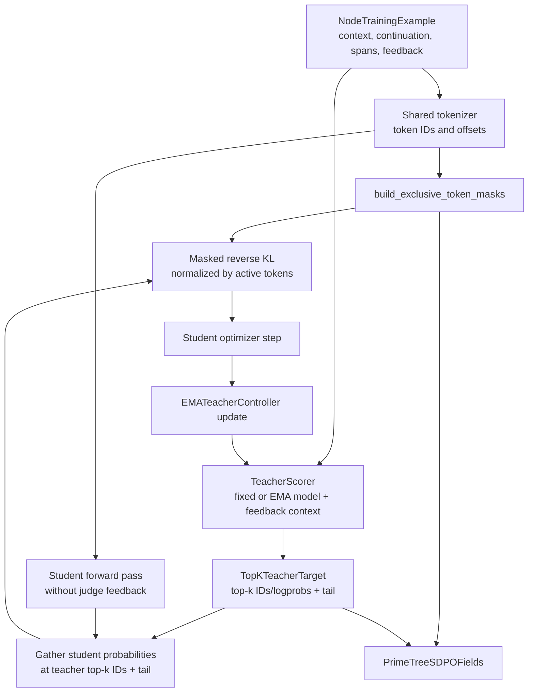

# SDPO package

The `rlm_train.sdpo` package defines the trainer-neutral pieces of tree-aware
self-distillation from policy optimization. It consumes node-level trajectory examples,
maps their character spans to tokens, represents feedback-conditioned teacher
targets, and computes masked reverse KL.

The package is intentionally an integration boundary. It contains validated data types,
loss kernels, fixed/EMA lifecycle execution, question scoring orchestration, caching,
configuration, and protocols, but it does not select a model architecture, run a teacher
server, or patch a particular Prime version.

Question-token distillation uses a deliberately separate path:

- `QuestionTeacherScorer.score_question()` receives one `QuestionTrainingExample` and
  its single restricted feedback object.
- `TopKQuestionTeacherScorer` validates all question/child/span identities and supplies
  only `QuestionTeacherFeedback` to a model-specific logits provider.
- `build_question_token_mask()` maps only that item's `CallItemSpan` to tokenizer
  offsets; sibling questions and surrounding list punctuation remain inactive.
- `PrimeQuestionSDPOFields` transports one edge-specific mask and target. It never
  bundles sibling feedback into the node-level `subcalls` payload.

## Locked initial decisions

`SDPOConfig` encodes the current depth-1 design:

| Decision | Initial value |
|---|---|
| KL direction | Reverse KL, `D_KL(student || teacher)` |
| Teacher | Fixed copy of the initial policy (EMA is an explicit control) |
| Vocabulary representation | Teacher top-k tokens plus one explicit tail bucket |
| Default `top_k` | 100 |
| Tokenizer | Same tokenizer for teacher and student, checked by fingerprint |
| Component masks | Exclusive |
| Maximum recursion depth | 1 |
| Privileged later evidence | Disabled |

Component weights for route, call, node reasoning, aggregation, final answer, and missing
calls remain configurable and non-negative. At least one component must be active.

## Where it fits



Judge feedback is visible to the teacher scorer only. The student input is the original
feedback-free node context and generated prefix. Teacher tensors are detached inside the
loss as a final gradient-safety boundary.

## Modules and contracts

| Module | Purpose | Main inputs | Main outputs |
|---|---|---|---|
| `config.py` | Lock objective choices and component weights | Teacher strategy, optional EMA rate, top-k, and weights | Immutable `SDPOConfig` |
| `masks.py` | Convert character spans into exclusive token ownership | `DecisionSpan` list and tokenizer offsets | Boolean mask per `DecisionKind` |
| `teacher.py` | Run fixed/EMA lifecycles, isolated scoring, and target extraction | Existing continuation, restricted feedback, teacher logits/model state | Frozen teacher controller and `TopKTeacherTarget` |
| `cache.py` | Prevent stale target reuse across question/model versions | Question identity/content and teacher/tokenizer/feedback versions | SHA-256 key and cached target |
| `loss.py` | Gather student top-k/tail and aggregate reverse KL | Student logits, teacher target, component masks/weights | Differentiable normalized component and total losses |
| `prime_adapter.py` | Define the payload for a pinned Prime integration | IDs, masks, teacher target, tokenizer fingerprint | Validated `PrimeTreeSDPOFields` |
| `metrics.py` | Accumulate component and information-value diagnostics | Loss sums, active-token counts, signed significance | Optional mean metrics |
| `__init__.py` | Stable package import surface | Python imports | Main config, teacher, and loss APIs |

## Inputs

### Node-level training example

The [`trajectory` compiler](../trajectory/README.md) produces a
`NodeTrainingExample` containing:

- `student_context`: the context visible to the sampled student;
- `continuation`: the exact sampled node response;
- `spans`: component character ranges over that continuation;
- `feedback`: node, edge, or final feedback relevant to those spans;
- trajectory, node, and policy identifiers.

### Token offsets

The shared tokenizer must return response-relative offsets for the continuation tokens.
Each `TokenOffset(start, end)` is compared with the decision spans. A token is assigned to
the first overlapping component in this precedence order:

1. call construction;
2. final answer;
3. routing;
4. aggregation;
5. child-node reasoning;
6. missing call.

Most overlaps should already have been resolved at the character-span level. Token-level
precedence handles the remaining case where a tokenizer token crosses a span boundary.
Zero-width special tokens remain inactive.

### Feedback-conditioned teacher target

For each continuation position, `TopKTeacherTarget` contains:

- teacher-selected vocabulary IDs;
- their full-softmax log-probabilities;
- one tail log-probability containing all other vocabulary mass;
- teacher version;
- tokenizer fingerprint.

The explicit probabilities plus tail must sum to one at every position. Rows must have a
constant width, token IDs must be unique and non-negative, and all values must be finite.

`extract_topk_teacher_target()` uses PyTorch `log_softmax`, `topk`, and `logsumexp` on
detached teacher logits. `gather_student_topk_with_tail()` gathers differentiable student
mass at the exact teacher-selected IDs and aggregates every other student token into the
tail bucket.

### Teacher lifecycle

`TorchFixedTeacherController.from_student()` deep-copies and freezes the initial policy,
records its exact state fingerprint, and validates after optimizer steps that no parameter
or buffer changed. This is the default and primary SDPO strategy.

`TorchEMATeacherController.from_student()` deep-copies and freezes the teacher. After a
successful optimizer step, `update_after_optimizer_step()` applies
`teacher = (1-rate) * teacher + rate * student`, updates floating-point buffers, copies
discrete buffers, and increments the teacher version. State dictionaries include both
the weights and lifecycle version for later checkpoint integration.

### Question target caching

`make_question_teacher_cache_key()` hashes trajectory/parent/child/call identity, exact
student context and continuation, question span, restricted feedback, teacher version,
tokenizer fingerprint, and feedback version. Any change forces a new teacher score.

## Outputs

### Exclusive component masks

```python
from rlm.core.trajectory import DecisionKind, DecisionSpan
from rlm_train.sdpo.masks import TokenOffset, build_exclusive_token_masks

spans = [
    DecisionSpan(DecisionKind.ROUTE, 0, 8),
    DecisionSpan(DecisionKind.CALL, 4, 12),
]
offsets = [TokenOffset(0, 4), TokenOffset(4, 8), TokenOffset(8, 12)]

masks = build_exclusive_token_masks(spans, offsets)
# masks[DecisionKind.ROUTE] == [True, False, False]
# masks[DecisionKind.CALL] == [False, True, True]
```

Every response token belongs to zero or one component, never more than one.

### Reverse-KL loss

For the coarsened student distribution `p` and detached teacher distribution `q`, the
implemented direction is:

```text
D_KL(p || q) = sum_i p_i * (log p_i - log q_i)
```

The index `i` ranges over the teacher's top-k token IDs and the aggregate tail bucket.
The tensor loss computes this value at each continuation position, applies one component
mask, sums active positions, and divides by active-token count. A component with no active
tokens must be skipped by the trainer; calling the loss with an empty mask raises an error.

The production loss stays in log space and preserves gradients only through the student:

```python
import math
import torch

from rlm_train.sdpo.loss import reverse_kl_topk_with_tail

loss = reverse_kl_topk_with_tail(
    student_logprobs=torch.tensor([[math.log(0.6), math.log(0.3)]], requires_grad=True),
    student_tail_logprobs=torch.tensor([math.log(0.1)], requires_grad=True),
    teacher_logprobs=torch.tensor([[math.log(0.4), math.log(0.4)]]),
    teacher_tail_logprobs=torch.tensor([math.log(0.2)]),
    mask=torch.tensor([True]),
)
```

### Prime transport payload

`PrimeTreeSDPOFields` packages masks and teacher targets for one tokenized node sample. Its
validator checks:

- student and teacher tokenizer fingerprints match;
- every mask length equals the continuation token count;
- teacher positions equal the continuation token count;
- masks remain exclusive at every position.

The dataclass deliberately does not import Prime. A future version-pinned adapter should
translate this stable payload into the exact transport/batch type expected by that Prime
release.

## Expected integration sequence

1. Compile a judged trajectory into node examples.
2. Tokenize `student_context + continuation` with the shared tokenizer and retain
   continuation-relative offsets.
3. Convert the example's character spans into exclusive token masks.
4. Run the configured feedback-conditioned teacher over the relevant prefix and retain
   full-softmax-normalized top-k IDs/log-probabilities plus tail mass.
5. Run the feedback-free student and gather its probabilities at the same top-k IDs;
   aggregate its remaining vocabulary probability into the tail bucket.
6. Compute each active component loss independently, normalized by its active tokens.
7. Apply `ComponentWeights` and combine active component losses with
   `weighted_component_reverse_kl()`.
8. Complete the student optimizer step.
9. For EMA controls only, update the teacher and increment its version after that step;
   fixed teachers validate that their fingerprint is unchanged.

## Metrics

`ComponentMetric` reports loss per active token for one component.
`SubcallInformationMetric` reports mean signed information significance separately from
final-answer reward. Keeping these streams separate prevents answer correctness from
silently redefining the value of a question or subcall.

## Current scope

- The model-specific question logits provider remains an integration point because
  prompt rendering and continuation-token alignment depend on the selected architecture.
- The package does not combine component losses into the existing Prime objective yet.
- The current Prime reward objective remains unchanged.
- Additive masks, privileged evidence in the teacher/student path, deeper recursion, and
  the version-pinned Prime adapter remain future extensions. Privileged context is
  available to the judge only and cannot enter `QuestionTeacherFeedback`.
