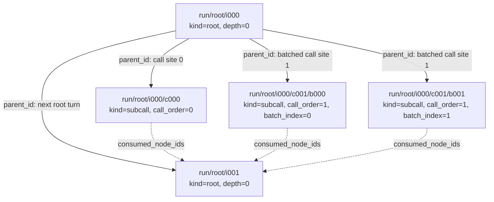

# Trajectory package

The `rlm_train.trajectory` package turns a depth-1 RLM rollout into a stable,
node-addressable tree, persists complete rollouts, and converts judged nodes into
trainer-neutral examples. It is the bridge between live rollout execution and the later
judge/SDPO stages.

The shared wire types live in [`rlm/core/trajectory.py`](../../../../rlm/core/trajectory.py).
This training package supplies the mutable recorder, deterministic response segmenter,
and feedback compiler.

## Where it fits

```mermaid
flowchart LR
    RP["Root policy response"] --> SEG["RLMResponseSegmenter"]
    SEG --> RS["Root decision spans"]
    RP --> ENV["RLMTrainEnv"]
    RS --> REC["TrajectoryRecorder"]
    ENV --> REPL["Persistent REPL worker"]
    REPL -->|"llm_query / rlm_query"| PROXY["SubLLMProxy"]
    PROXY -->|"prompt, response, trace context"| REC
    REC --> TREE["TrajectoryTree snapshot"]
    TREE --> JUDGE["TrajectoryJudge"]
    TREE --> STORE["Versioned JSONL artifact"]
    STORE --> REPLAY["OfflineTrajectoryReplay"]
    JUDGE --> FB["TrajectoryFeedback"]
    TREE --> COMP["TrajectoryCompiler"]
    FB --> COMP
    COMP --> EX["NodeTrainingExample list"]
    COMP --> QEX["QuestionTrainingExample list"]
    REPLAY --> COMP
    EX --> SDPO["Teacher scoring and SDPO"]
```



The recorder does not judge responses, tokenize text, or compute a loss. Those concerns
remain in the `judge` and `sdpo` packages.

## How the depth-1 tree is organized

Consider a first root turn that makes one single call and one batched call. The next root
turn receives those results and synthesizes them:



There are three related structures in this diagram:

1. `parent_id` connects each subcall to the root response that generated it.
2. Consecutive root turns are chained through `parent_id` so rollout order is retained.
3. `consumed_node_ids` records which earlier child results are visible to a later root
   turn. These dashed information-flow edges are what enable aggregation feedback.

The call span on `root/i000` also points back to its child. A single call uses
`related_node_id`; a batched call records all children in
`span.metadata["related_node_ids"]`.

An independent `CallItemSpan` covers each literal question expression. Its
`(call_order, batch_index)` coordinate is bound to the exact runtime `child_node_id`.
Dynamic lists and comprehensions are counted as unaddressable and never receive an
approximate token mask.

## Stable node IDs

| Invocation | ID pattern | Example |
|---|---|---|
| Root turn | `{trajectory_id}/root/i{iteration}` | `run/root/i000` |
| Single child call | `{parent_id}/c{call_order}` | `run/root/i000/c000` |
| Batched child | `{parent_id}/c{call_order}/b{batch_index}` | `run/root/i000/c001/b000` |

Indices are zero-based and zero-padded. Batched responses may finish out of order, but
their IDs and snapshot order remain deterministic.

## Modules and contracts

| Module | Purpose | Main inputs | Main outputs |
|---|---|---|---|
| `recorder.py` | Incrementally build a thread-safe trajectory | Invocation context, model, parent/call metadata, response, spans | Stable node IDs and validated `TrajectoryTree` snapshots |
| `segmenter.py` | Locate policy decisions in exact response text | Root or child response strings | Exclusive, response-relative `DecisionSpan` objects |
| `compiler.py` | Join a completed tree with judge feedback | `TrajectoryTree` and `TrajectoryFeedback` | `NodeTrainingExample` objects |
| `artifacts.py` | Persist complete, versioned rollout inputs | Task/model/tokenizer identity, tree, feedback, versions, and seeds | `TrajectoryArtifact` JSONL records |
| `replay.py` | Rejudge, recompile, re-tokenize, and rebuild masks offline | Stored artifact, optional judge and exact tokenizer | Replay examples, masks, and coverage metrics |
| `__init__.py` | Stable package import surface | Python imports | Recorder, segmenter, compiler, and example types |

### Shared data types

The shared `rlm.core.trajectory` module defines:

- `DecisionSpan`: a half-open character interval `[start, end)` in a node response.
- `CallItemSpan`: one exact question expression plus call coordinates and bound child.
- `InvocationNode`: one root or subcall invocation, its visible context, response, and
  decision spans.
- `TrajectoryTree`: the rollout ID, all nodes, and rollout metadata.
- `DecisionKind`: `route`, `call`, `node`, `aggregation`, `final`, or `missing_call`.

Keeping these types outside the training package allows rollout code to emit traces
without depending on Pydantic, PyTorch, Prime, or a judge provider.

## Runtime construction workflow

### 1. Record a root response

`RLMTrainEnv.get_prompt_messages()` creates a root node before executing its generated
code. Its context is the exact message history visible to the root policy, and its
response is segmented before any child calls are made.

### 2. Segment policy decisions

`RLMResponseSegmenter` parses fenced REPL code with Python's AST:

- `llm_query`, `rlm_query`, and their batched variants become `CALL` spans.
- Control-flow headers containing those calls become `ROUTE` spans.
- Assignments to `answer["content"]` or `answer["ready"]` become `FINAL` spans.
- A child response becomes one trimmed `NODE` span.
- When child results are visible, parent prose outside new REPL code becomes
  `AGGREGATION`.

Overlaps are resolved with narrow call expressions taking precedence over broader final
or routing spans. The resulting spans are exclusive before tokenization.

### 3. Propagate trace context through execution

Each REPL block receives:

```python
{
    "parent_node_id": root_node_id,
    "code_block_index": block_index,
    "call_order_offset": prior_dynamic_call_sites,
}
```

The worker adds `call_order`, `call_kind`, and, for a batch, `batch_index`. The proxy
returns that metadata to the environment's recording callback with the child prompt and
response.

### 4. Record and bind child nodes

The callback creates a depth-1 `SUBCALL` node, segments its response as node reasoning,
and binds the child ID to the appropriate call span on the parent root node.

### 5. Mark consumed evidence

Child IDs remain pending until the next root turn is recorded. That root lists them in
`consumed_node_ids`, making the evidence flow explicit for aggregation judging.

### 6. Compile judged nodes

`TrajectoryCompiler` validates that feedback references real nodes and real
parent-child edges. It then:

- attaches subcall information-value feedback to the parent that asked the question;
- attaches final feedback to nodes containing final spans, or the last root as fallback;
- converts routing spans to `MISSING_CALL` when the judge identifies an omitted call;
- emits only nodes that have applicable feedback.

`compile_questions()` is a separate path. It emits one `QuestionTrainingExample` for
each judged, bound item and converts full judge feedback to `QuestionTeacherFeedback`.
The returned example contains no sibling feedback, judge rationale, final reward, or
outcome-contribution signal. Callers explicitly choose whether unaddressable judged
edges fail validation or are skipped.

Tokenization happens after compilation so teacher and student can use the exact same
tokenizer and offset mapping.

### 7. Persist and replay the rollout

`TrajectoryArtifact.from_task()` captures public task state, dataset/example identity,
model and tokenizer versions, the complete tree, optional feedback, teacher/anchor
identity, configurations, and seeds. If the task has privileged judge context, only its
payload-free descriptor is stored.

`JSONLTrajectoryStore` appends unique, schema-versioned records and validates each line
when it is read. `OfflineTrajectoryReplay` can replace judge feedback without another
student rollout, recompile node and isolated-question examples, verify the exact
tokenizer fingerprint, and rebuild response-relative component/question masks.

```bash
uv run rlm-train-replay path/to/rollouts.jsonl
```

The command emits a JSON coverage/compilation summary for each stored artifact. Provider
specific rejudging and tokenizer adapters use the Python API.

## Minimal recorder example

```python
from rlm.core.trajectory import DecisionKind, DecisionSpan, InvocationKind
from rlm_train.trajectory import TrajectoryRecorder

recorder = TrajectoryRecorder("run")
root_id = recorder.begin_node(
    kind=InvocationKind.ROOT,
    model="student-model",
    context=[{"role": "user", "content": "Investigate the result"}],
    depth=0,
)
response = "llm_query('What did the control reveal?')"
recorder.complete_node(
    root_id,
    response=response,
    spans=[DecisionSpan(DecisionKind.CALL, 0, len(response))],
)

child_id = recorder.begin_node(
    kind=InvocationKind.SUBCALL,
    model="student-model",
    context="What did the control reveal?",
    parent_id=root_id,
    depth=1,
    call_order=0,
)
recorder.complete_node(child_id, response="The effect disappears under the control.")
recorder.bind_call_span(root_id, 0, child_id)

tree = recorder.snapshot()
tree.validate()
```

## Invariants and current scope

- Character offsets always refer to the exact stored response.
- Snapshotting deep-copies state and validates every node and span reference.
- Static AST segmentation may leave dynamically generated or syntactically invalid call
  sites unbound; these are retained in node metadata instead of silently discarded.
- `summarize_question_trace()` reports total, bound, unaddressable, and judged question
  counts for rollout validation.
- The initial training workflow records depth-1 children only.
- JSONL storage is append-only and process-local; a distributed store can implement
  `TrajectoryArtifactStore` later.
- The package does not instantiate a judge provider, teacher model, tokenizer, or
  optimizer.
